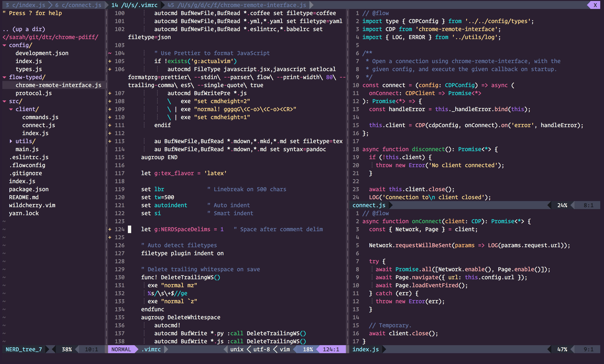

# wild-cherry-vim

Bad Vim port of the [Wild Cherry](https://github.com/mashaal/wild-cherry/) theme, with additional support for JavaScript syntax highlighting through [vim-javascript](https://github.com/pangloss/vim-javascript).

Pairs nicely with Darcula for bufferline and statusline plugins.

Disclaimer: I totally stole the theme file format from my other favorite theme, [ayu](https://github.com/ayu-theme/ayu-vim).
